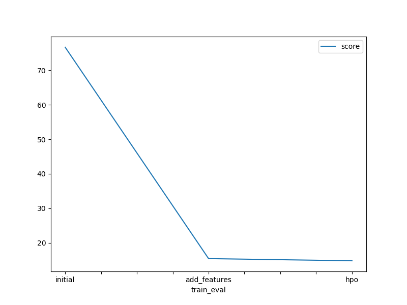
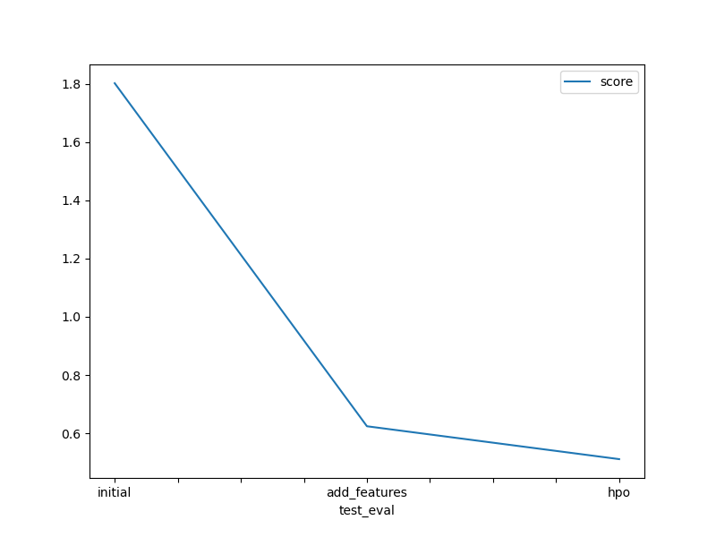

# Report: Predict Bike Sharing Demand with AutoGluon Solution
#### Aadarshini Vinod Das

## Initial Training
### What did you realize when you tried to submit your predictions? What changes were needed to the output of the predictor to submit your results?
When I first generated predictions using the AutoGluon predictor, I noticed that some of the predicted count values were negative, which is not valid in the context of bike rentals. To correct this, I applied a post-processing step where all negative predictions were set to zero before submission. This ensured that my submission met the competition’s requirements.

### What was the top ranked model that performed?
The best-performing model in the initial training was an ensemble that relied primarily on a LightGBM model. AutoGluon selected this automatically based on validation performance.

## Exploratory data analysis and feature creation
### What did the exploratory analysis find and how did you add additional features?
Through exploratory analysis, I observed clear patterns based on time, such as variations in bike rentals by hour, day of the week, and month. I created new features like hour, dayofweek, and month from the datetime column to help the model capture these temporal patterns. I also converted season and weather into categorical variables for better model interpretation.

### How much better did your model preform after adding additional features and why do you think that is?
After adding features, the model's Kaggle score improved significantly from 1.80164 to 0.62439. These new features helped the model better understand and learn from underlying patterns in user behavior across different times and conditions.

## Hyper parameter tuning
### How much better did your model preform after trying different hyper parameters?
With hyperparameter tuning applied using medium_quality_faster_train presets, the model improved further to a score of 0.51154. Tuning helped optimize model configuration for better generalization without overfitting.

### If you were given more time with this dataset, where do you think you would spend more time?
Given more time, I would, Create more features like flags for rush hour or holidays that fall on weekends, Try combining the best models manually (ensembling) to improve accuracy, Look at which features are most important to reduce unnecessary ones and Use a bigger machine to avoid memory issues and run better hyperparameter tuning.

### Create a table with the models you ran, the hyperparameters modified, and the kaggle score.
|model|hpo1|hpo2|hpo3|score|
|--|--|--|--|--|
|initial|default|NA|NA|1.80164|
|add_features|added hour/day/month|season as category|weather as category|0.62439|
|hpo|presets=medium_quality_faster_train|TIME=600S|default models|0.51154|

### Create a line plot showing the top model score for the three (or more) training runs during the project.

### Create a line plot showing the top kaggle score for the three (or more) prediction submissions during the project.

## Summary
This project involved building a bike rental prediction model using AutoGluon. Starting with a baseline model trained on raw features, I observed that the model produced some invalid negative predictions, which had to be corrected. From there, I enhanced the model through exploratory data analysis by engineering meaningful time-based features like hour, day of the week, and month, and converting some columns to categorical types. These additions led to a substantial improvement in prediction accuracy. Further improvements were achieved by tuning hyperparameters using AutoGluon's presets, despite limited computational resources. Ultimately, the model's performance on Kaggle improved from an initial score of 1.80164 to 0.62439 after feature engineering, and finally to 0.51154 after hyperparameter optimization. This exercise demonstrated the power of simple feature engineering and the impact of tuning on model performance. With more time and resources, additional gains could likely be achieved through deeper feature analysis and model ensembling.
